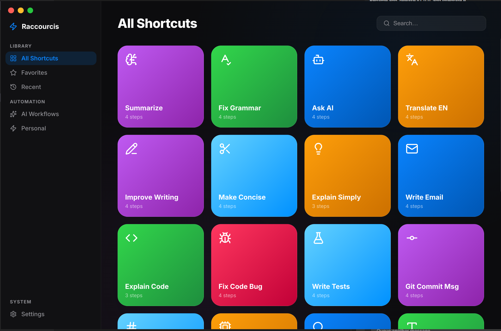

<div align="center">



# Raccourcis

**A premium shortcuts & automation app for Ubuntu Linux — inspired by Apple Shortcuts.**  
Chain AI, system, and external service actions into powerful one-click workflows.

[](LICENSE)
[](https://ubuntu.com)
[](https://www.electronjs.org)
[](RELEASE_NOTES.md)

</div>

---

## Overview

Raccourcis brings the elegance of Apple Shortcuts to your Ubuntu desktop. Build multi-step automation workflows by chaining **AI nodes**, **system commands**, and **external service integrations** — all from a beautiful glassmorphism interface.

---

## Features

| Category | Highlights |
|---|---|
| **Premium UI** | Apple-inspired glassmorphism, vibrant gradients, smooth 60 fps transitions |
| **Workflow Engine** | Visual node editor with drag-and-drop step reordering |
| **AI Integration** | LLM prompts, Text-to-Speech, Speech-to-Text, DALL·E image generation, GPT-4o Vision |
| **Web Services** | Firecrawl scraping, Google Search & Calendar, YouTube, Wikipedia, Gmail, Weather |
| **Developer Tools** | GitLab API (issues, MRs, pipelines), Nextcloud files & notes |
| **Utilities** | QR Code generator, SMTP email, shell commands, clipboard I/O |
| **Ubuntu Native** | Window controls, system clipboard, audio playback, shell execution via Electron IPC |
| **Open Source** | Apache 2.0 — fork it, extend it, ship it |

---

## Built-in Actions

<details>
<summary><strong>Input</strong></summary>

- Read Clipboard
- User Input (dialog prompt)
</details>

<details>
<summary><strong>AI</strong></summary>

- AI Prompt (any OpenAI-compatible endpoint)
- Image Generation (DALL·E 3)
- Image Vision (GPT-4o)
- Text to Speech (OpenAI TTS)
- Speech to Text (Whisper)
</details>

<details>
<summary><strong>Output</strong></summary>

- Write Clipboard
- Show Result panel
- Open URL in browser
</details>

<details>
<summary><strong>Services</strong></summary>

- Firecrawl Scrape
- Google Custom Search
- YouTube Search
- Wikipedia Summary
- Google Calendar — List Events
- Gmail — Send Email
- OpenWeatherMap — Current Weather
- SMTP — Send Email
- GitLab — List Issues / Merge Requests / Pipelines
- QR Code Generator
- Nextcloud — List Files / Upload File / Create Note
</details>

<details>
<summary><strong>System</strong></summary>

- Run Shell Command
- Save to Variable
- Wait / delay
</details>

---

## Getting Started

### Prerequisites

- **Node.js** v18+
- **npm** (or yarn)
- Ubuntu 20.04+ (or any modern Electron-compatible Linux)

### Installation

```bash
# Clone the repository
git clone https://github.com/rzafiamy/raccourcis.git
cd raccourcis

# Install dependencies
npm install

# Run in development mode
npm run dev
```

### Build for Production

```bash
npm run build
```

The packaged `.AppImage` and `.deb` are output to `dist/`.

---

## Configuration

Open **Settings** (sidebar → Settings) to configure each service:

| Service | What you need |
|---|---|
| AI Provider | API key + base URL (OpenAI, Mistral, Ollama…) |
| Firecrawl | API key from [firecrawl.dev](https://firecrawl.dev) |
| Google Search | Google Cloud API key + Custom Search Engine ID |
| YouTube | Google Cloud API key with YouTube Data API v3 |
| Google Calendar | OAuth 2.0 Bearer token (`calendar.readonly`) |
| Gmail | OAuth 2.0 Bearer token (`gmail.send`) |
| OpenWeatherMap | Free API key from [openweathermap.org](https://openweathermap.org) |
| SMTP | Host, port, credentials for any mail server |
| GitLab | Instance URL + Personal Access Token |
| Nextcloud | Instance URL + username + app password |

All credentials are stored in `localStorage` — never logged or exported in plaintext.

---

## Project Structure

```
raccourcis/
├── electron/          # Electron main process (IPC handlers, shell, SMTP)
├── src/
│   ├── actions.js     # Action registry — definitions & params
│   ├── workflow.js    # Workflow executor — step runners & service calls
│   ├── store.js       # Persistence — localStorage abstraction
│   ├── ui.js          # Rendering helpers — cards, overlays, palette
│   ├── renderer.js    # Main orchestrator — routing, settings, editor
│   └── style.css      # Design system — tokens, layout, components
├── index.html         # App shell + settings modal
├── RELEASE_NOTES.md   # Changelog
└── vite.config.js
```

---

## Contributing

Contributions are welcome! Please:

1. Fork the repository
2. Create a feature branch (`git checkout -b feat/my-feature`)
3. Commit with a conventional message (`feat:`, `fix:`, `chore:`)
4. Open a Pull Request

---

## License

Licensed under the **Apache 2.0 License** — see [LICENSE](LICENSE) for details.
